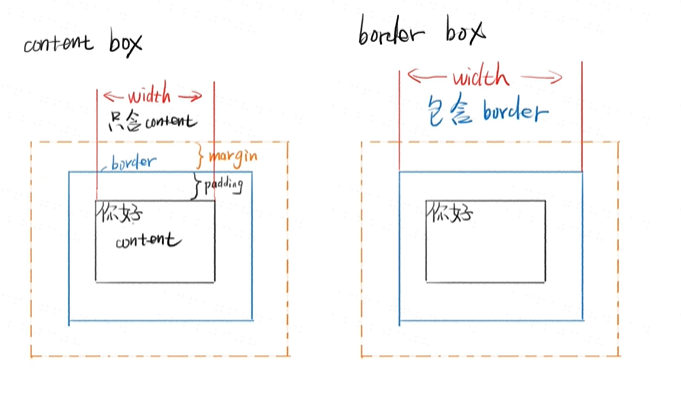
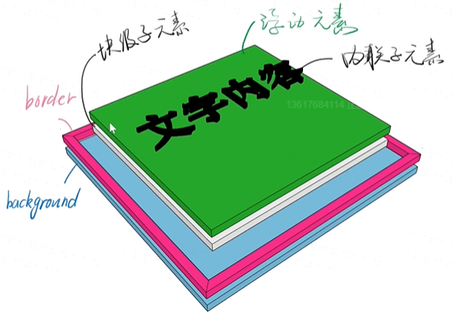

# css总结
## 一些网站  
  1. caniuse.com：查询哪些浏览器支持哪些特性  
  2. 资料查询：谷歌搜索关键词加mdn、css tricks、张鑫旭的博客  
  3. css最新标准：搜索css spec  
## 语法  
```
一、样式语法：
p{                       选择器{
  color: red;                  属性名：属性值；
                                /*注释*/
}                               }
二、at语法：
@charset"UTF-8";
@import URL(2.CSS);
@media(min-width:100px)and(max-width:200px){
    语法一
}
```
## Border调试法  
怀疑某个元素有问题，就给这个元素加border，看看边界是否符合预期。
如果border没有出现，说明选择器错了或者语法错了
## 文档流
1. 块block：每一个都默认占一行。div。默认宽度aotu不要写百分之百。高度由内部文档流元素决定。  
2. 内联inline：从左到右，最后边才会换行。span。宽度是内部元素的和，不接受宽度。高度是由行高确定的，即line-height，跟height无关。  
3. 内联块inline-block：从左到右，和inline区别就是不会跨两行，不会把自己分成两半。可以设置高。  
4. 可以直接使用display：inline或者display：block让内联元素和块元素进行转换  
5. 溢出：overflow
## 盒模型
1. Content-box内容盒：宽度=内容宽度  
2. Border-box边框盒：宽度=内容宽度+padding+border  

## float布局
1.	在子元素上加float：left和width
2.	在父元素上加  .Clearfix
## flex布局
1.	父元素container————容器
2.	子元素items————项
3.	改变items主轴流动方向：
```
.container{
    flex-direction: row|row-reverse|column|column-reverse;
    /*左到右排|右到左排|竖着从上往下排|竖着从下往上排*/
}
```
4.	改变折行
```
.container{
   flex-wrap: nowrap|wrap|wrap-reverse；
    /*不折行|折行*/
}
```
5.	主轴对齐方式
```
.container{
   justify-content: flex-start|flex-end|center|space-around|space-between;
    /*挤在开头|挤在结尾|挤在中间|把空隙放在周围|把空隙放在中间*/
}
```
6.	次轴对齐
```
.container{
     align-items:stretch|flex-start|flex-end|center
    /*一样高|顶在上面|抵到底部|居中*/
}
```
7.	多行内容
```
.container{
     align-content: flex-start|flex-end|center|stretch|space-between|space-around;
}
```
8.	Items加Order可以改变顺序
9.	Items加flex-grow：数字；用来分配多余的空间，控制变胖
10.	Items加flex-shrink：数字；空间变少时，控制变瘦。
11.	Flex：flex-grow flex-shrink flex-basis。缩写 空格隔开
12.	某一个itmes可以特立独行。如align-self：flex-end。
## Grid布局
1.	grid的语法。
```
.contaainer{
     display: grid;
}
```
2.	设置行列
```
.contaainer{
     display: grid;
    grid-template-columns: 40px 50px auto 50px 40px;
grid-template-rows: 100px 300px 100px;
}
```
3.  Items可以设置范围
```
.items{
    grid-column-start: ;
    grid-column-end: ;
    grid-row-start: ;
    grid-row-end: ;
}
```
## div的分层 

## Position的五个取值
1.	static默认值，待在文档流里。
2.	relative相对定位，升起来，但不脱离文档流，配合z-index使用
3.	absolute绝对定位，定位基准非static
4.	fixed固定定位，关于视口的定位。
5.	sticky粘滞定位
## css动画
1.	浏览器渲染原理
根据html构建html树（dom）
根据css构建css树（cssom）
将dom和cssom合并成一颗渲染树（rendertree）
Layout布局（文档流，盒模型，计算大小和位置）
Paint绘制（边框颜色，文字颜色等）
Compose合成（层叠关系展示）
2.	动画的两种做法  
2.1	使用两次transform  
A→transform→B
B→transrorm→C  
2.2	使用animation  
声明关键帧
添加动画
```
#demo.star{
  Animation:xxx 15s;
}
@keyframes xxx {
  0% {
   transform: none;
  }
  50% {
    transform: scaleX();
  }
  100% {
    transform: scaleY();
  }
}
```


